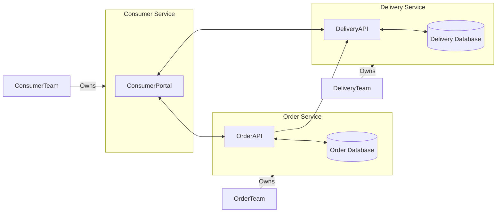
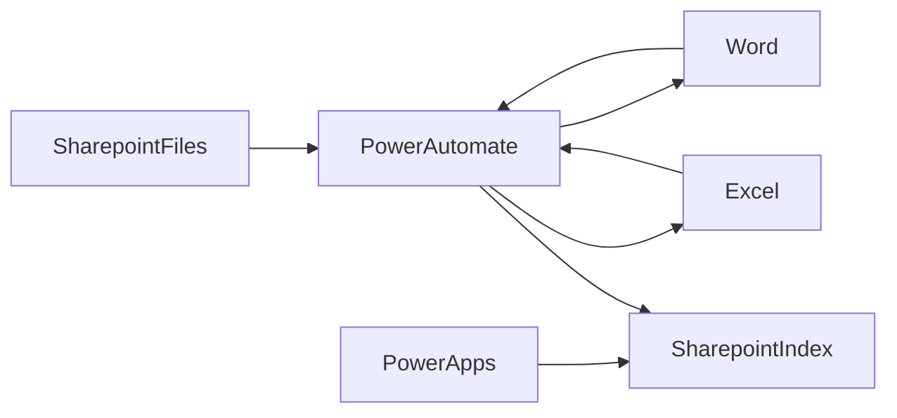
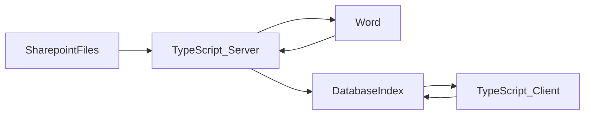

This post is currently being developed! 👀🥷 Please come back later! 😄

## Introduction

### What is Microsoft's Power Platform

Microsoft Power Platform is an attempt at a low-code suite of apps, connectors, and a data platform to empower individuals to develop apps, automate workflows and analyze data. It comprises of 5 microservices each with their own target objectives:

- Power BI - For analysing data and generating Business Intelligence
- Power Apps - For building internal web apps (typically [CRUD](https://www.codecademy.com/article/what-is-crud) apps)
- Power Pages - For building customer facing web apps
- Power Automate - For building workflows to automate systems
- Power Virtual Agent - For building chat bots.

The Power Platform's target audience is Business users/SMEs and was designed primarily with the intention of reduce the number of apps that the business wants that IT teams need to build, by empowering the users to build software for themselves.

In this article we will focus on `Power BI`, `Power Apps` and `Power Automate`

### Other topics which will be discussed

  
<b>What is a microservice architecture</b>

Microservices are an architectural and organizational approach to software development where software is composed of small independent services that communicate over well-defined APIs. For instance imagine having a delivery company, this could be arranged as follows:

This is a microservice approach. The Delivery Team owns and maintains the delivery database and APIs. The Order team owns and maintains the order database and APIs. The consumer team own the consumer portal and make use of the delivery and order APIs. Each time can work fully in isolation from one another.

One of the most important aspects of microservice architectures is the dependency on unchanging APIs. When APIs do change they are versioned to ensure that existing older APIs continue operation, while allowing newer services to use newer APIs over time. `server/v1/orders/getOrder({orderID})` later becomes `server/v2/orders/{orderID}` while maintaining the 1st API even on created versions. This ensures that other services remain [decoupled](https://www.techopedia.com/definition/598/decoupled#:~:text=What%20Does%20Decoupled%20Mean%3F,knowledge%20about%20the%20other%20services.)

Another important characteristic os microservices is that each service is bound to a particular domain and doesn't stray out of this domain. The delivery team doesn't start managing orders, and the order team doesn't create a seperate consumer portal.

## Does the power platform provide a good microservice framework?

At first glance, The PowerPlatform provides a great framework for building a microservice. Automate's domain is automation, App's domain is making applications, BI's domain is analysising data etc.

---

## External references

- https://www.reddit.com/r/PowerApps/comments/rt1knj/are_power_apps_really_that_great_i_feel_like/
- https://www.reddit.com/r/PowerApps/comments/kjhyd7/who_is_powerapps_actually_for_and_what_do_you_do/
- https://www.reddit.com/r/PowerApps/comments/u3kh2h/what_are_your_thoughts_on_the_future_of_powerapps/

## General

### A cluttered eco system

PowerPlatform results in a cluttered system of technologies rather than a cohesive user experience.

Example - From a `PowerApp` we want to build a search functionality whereby users can search for a reference and find all word documents (in `Sharepoint`) relating to that reference. First we need to obtain these references from our documents, so we create a `PowerAutomate` application to read the contents of the document into a string using `Word Online`, then scans this document using regex provided by the `Excel OfficeScript` API, to obtain and build a database of references -> documents stored in `Sharepoint`. Our PowerApp can now search this Sharepoint to find documents referring to this data. In one use case we have used 5 seperate technologies.

Arguably some of these components are required, but with a monolithic software architecture driven by a modern programming language like `TypeScript`, yes we still consume `Sharepoint`, `Word Online` and `Database` because we have to, but we aren't forced to query Excel unnecessarily just because that's the only way we can run regex...

In reality this example is very simple, but is made extremely complicated by the way Microsoft Power Platform services are set up.

## Power BI

> Multi-row card displays its fields in a vertical layout, and there is no out-of-the-box feature to switch it to a horizontal layout

> Can only hold 30k characters in each PowerBI cell. Sometimes images in base64 are more than this.

> Power BI is notoriously bad for ragged hierarchy data

No Geographic data operations.

## Power Automate

### General

- Uncapable of dealing with advanced formats which may be part of a process. E.G. [This link](https://services.arcgis.com/VTyQ9soqVukalItT/arcgis/rest/services/Empowerment_Zones_and_Enterprise_Communities/FeatureServer/3/query?f=pbf&objectIds=257&outFields=CONTADDR1%2CCONTADDR2%2CCONTCITY%2CCONTDEPT%2CCONTEMAIL%2CCONTFAX%2CCONTFSTNM%2CCONTLSTNM%2CCONTMIDNM%2CCONTNMPRE%2CCONTNMSUF%2CCONTORG%2CCONTPHONE%2CCONTSTATE%2CCONTTITLE%2CCONTZIP%2CCOUNTYFIPS%2CDSITE%2CDSITENAME%2CFIPS%2CFULLNAME%2CLINK%2CNAME%2COBJECTID%2CPERIODA%2CPERIODB%2CPERIODC%2CPERIODD%2CSTATEABBR%2CSTATEFIPS%2CShape__Area%2CShape__Length%2CTRACT%2CTRACTYEAR%2CTYPE%2CURBANRURAL&outSR=102100&returnGeometry=false&spatialRel=esriSpatialRelIntersects&where=1%3D1) automates an ArcGIS server and returns a [ProtocolBuffer](https://protobuf.dev/). Parseing protocol buffers is not an easy task in most languages, but in PowerAutomate? No chance really.
- Cannot use regex
- No object creation or population. Have you ever wanted to remove duplicates and been forced to use an O(n^2) algorithm unnecessarily?

> We spent months in development trying to get this software to work for us and it still didn't end up being reliable. Any anomaly in system behavior would cause the automation to fail. Because the automation used pictures of websites controls to do the automation, it would fail if those controls happen to move a litle by something as simple as resolution change or window movement. We had the automation use excel to process reports but if excel needed a moment to process the data winauto would end up stalling and not moving forward when excel was ready. Frankly **the months of setup** we went through to get this working was **replaced by a 3 day development cycle** to put together a python script, vbs script and then using windows task scheduler to automate.

- Connectors and Custom Connectors are a nightmare
- OAUTH is a nightmare

- Events/Triggers occasionally get turned off because they aren't running with message "Alert! Your flow has been turned off since it was not running". What's the point of a trigger if it get's turned off randomly?

### Performance

- Power Automate is sooooooo slow.
- Running js in the browser is faster

### Missing features

- Code editor
- Regex
- Hash/Dictionary creation and usage

## Power Apps

### Design

### Pricing

> Stay away, new pricing effective 10/1/2019 took our cost from $3,000 a year to $54,000 and Microsoft gave a 3 week notice of price change. Workflows was $165 a year now will cost us $30,000 a year,
> Users was $3,000 a year, now will cost us $24,000 a year. I’ve been developing within Powerapps for the past 18 months for my company, it has great potential if Microsoft wasn’t so greedy (and we only have 50 employees). I’m now looking to learn/move all apps to a different platform.

> If we have more complex functionality with more logic embedded into the app, debugging can often be difficult. We have to use little hacks to debug the app which is time consuming. Another problem is that it is hard to work with the delegation errors. Making a simple filter using the "in" operator cuases problems sometimes, when this should be simple. Also, the data limitations of 2000 records makes it hard to work with this app. Often, our lists go up to 5000 records and we need to be able to pull in those records into the app in a gallery. Otherwise it results in loading issues.
> Another nice to have feature would be if the version control had metadata about what changes were made in each version, sort of like traditional version control. Sometimes I'll keep publishing incremental changes to work around this, but it will be nice to have.
> Another issues we've come across is if connections change in the app. Updating them in the app proves to be cumbersome and can break several areas in the code.

### Error handling

> Attrocious error handling
